<!-- ██████  KHUSHI SHUKLA · GitHub Profile  ██████ -->
<!-- Every metric below is rendered by ./render_cards.py and refreshed
     automatically by .github/workflows/cards.yml — fire and forget. -->

  

  

  
  &nbsp;
  
  &nbsp;
  
  &nbsp;
  

 

  <h2>💎 About Me</h2>

- 💠 &nbsp;**Full-stack web developer** who cut her teeth building fast, polished interfaces for the **diamond &amp; jewellery industry** — turning intricate catalogues into brilliant web experiences.
- 📚 &nbsp;Began my journey in **education**, so I care deeply about clarity, mentoring, and making the complex feel simple.
- 🎓 &nbsp;Currently at the **New York Institute of Technology**, New York.
- ⚡ &nbsp;I build with **JavaScript, React &amp; Node** — clean, accessible, responsive UI is my craft.
- ✨ &nbsp;Fun fact: great code, like a great diamond, is all about **the cut**.

 

  <h2>💠 GitHub Brilliance</h2>
   
  
  &nbsp;
  

  

  

  

 

  <h2>🛠️ Tools &amp; Technologies</h2>

  
  
  
  
   
  
  
  
  

 

  

