<!-- ██████  KHUSHI SHUKLA · GitHub Profile  ██████ -->
<!-- Every metric below is rendered by ./render_cards.py and refreshed
     automatically by .github/workflows/cards.yml — fire and forget. -->

  

  

  <h2>💎 About Me</h2>

- 💎 &nbsp;**Data Analyst @ Allure Diam Inc** &mdash; turning diamond &amp; jewellery supply-chain, sales, and operations data into **Power BI** dashboards and decisions leadership can act on.
- 📊 &nbsp;I live in **SQL, Power BI &amp; Tableau** by day and build **full-stack apps** (React · Node · MongoDB) by night.
- 📚 &nbsp;Spent two years in **higher-ed technology** at **NYIT**, supporting **5,000+ students** with Canvas LMS, workflow automation, and training.
- 🎓 &nbsp;**M.S. in Computer Science** (NYIT, With Distinction) &mdash; currently exploring **Generative &amp; Agentic AI**.
- ✨ &nbsp;Based in **Jersey City, NJ**. Fun fact: great insight, like a great diamond, is all about **the cut**.

 

  <h2>💠 GitHub Brilliance</h2>
   
  

  

  

  

  <h2>🛠️ Tools &amp; Technologies</h2>

  <b>◆ Data &amp; Analytics</b>
   
  
  
  
  
  
  

  <b>◆ Web Development</b>
   
  
  
  
  
  
  

  <b>◆ AI &amp; Automation</b>
   
  
  
  
  

 

  <h2>🚀 Featured Projects</h2>

- 🧭 &nbsp;**Roamease — Travel Recommendation &amp; Analytics** · *SQL · Power BI · Power Query* — analysed user-behaviour patterns to lift recommendation accuracy **+25%** and cut duplicate records **20%**.
- 🎓 &nbsp;**Placement Management System** · *AngularJS · Node.js · MySQL* — a three-portal university placement platform for admins, students, and companies.
- 🏨 &nbsp;**Hotel Management System** · *React · Node.js · MongoDB* — full-stack operations platform with real-time room status and role-based access.
- 📈 &nbsp;**Data Quality Monitoring &amp; Automated Reporting** · *Excel · Power Automate · Tableau* — automated data-quality tracking that cut manual effort **40%**.

  <h2>📫 Let's Connect</h2>

  
  &nbsp;
  
  &nbsp;
  
  &nbsp;
  

 

  

